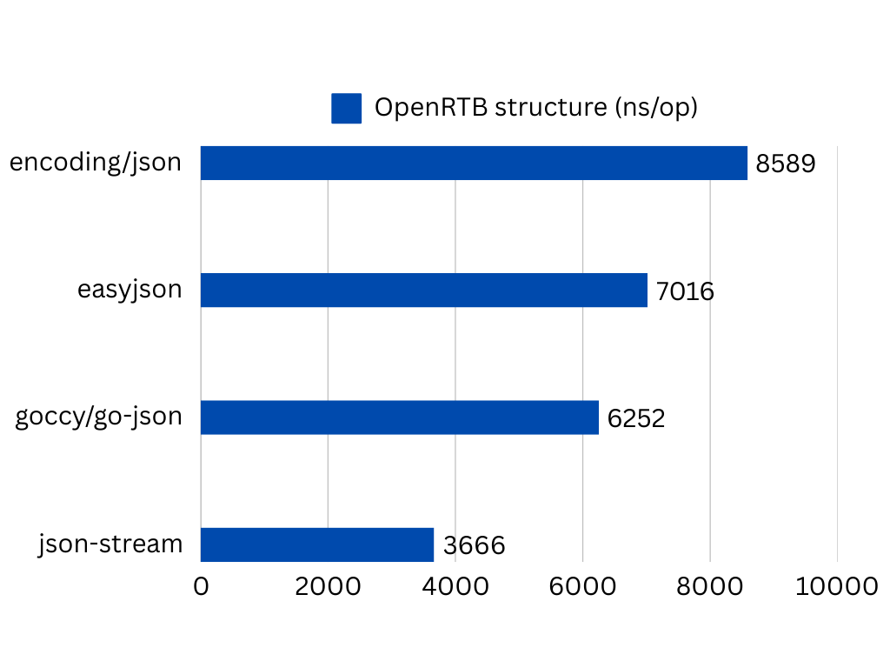

Code, which generates JSON with qtc files

to re-generate run `make run` from current directory.

# Json-stream Marshaling Library

This library provides a fast and efficient solution for JSON marshaling in Golang through code generation and quicktemplate templates. It is particularly effective for structures with a large number of fields, ensuring optimal performance and reduced overhead compared to traditional JSON encoding approaches.
## Features
- **Code generation for JSON marshaling**
- Support for various field types, including integers, strings, booleans, floats, slices, maps, structs, and pointers
- Custom handling for `structpb.Struct`
- Optional preprocessing mode for advanced control
- Ability to add a `copyFrom` function to generated structures

## Getting Started

### Prerequisites
- Golang installed (version 1.18 or higher recommended)
- `qtc` binary from [quicktemplate](https://github.com/valyala/quicktemplate)

### Running the Generator
1. Configure the Makefile with appropriate paths:
    - `DST`: The output directory for generated files
    - `IMPORT_PATH`: The import path for the generated package
    - `SRC`: The source file containing structures to be marshaled

2. Run the generator:
```bash
make run
```

3. (Optional) Enable preprocessing mode to perform additional setup before code generation:
```bash
make preprocessing
```

### Flags
The generator supports the following flags:
- `-prepocessing` (boolean): Enable preprocessing mode
- `-copyFromFeature` (boolean): Generate `copyFrom` functions for structures

### Supported Field Types
The library supports JSON marshaling for the following field types:
- Integers: `int`, `int8`, `int16`, `int32`, `int64`, `uint`, `uint8`, `uint16`, `uint32`, `uint64`
- Strings
- Booleans
- Floats: `float32`, `float64`
- Slices and arrays
- Maps
- Structs
- Pointers

Additional handling for `structpb.Struct` is included.

# Benchmarks Marshaling



## Contributing
Contributions are welcome! Feel free to open issues or submit pull requests.

---
For more details, check out the source code or contact the maintainer.