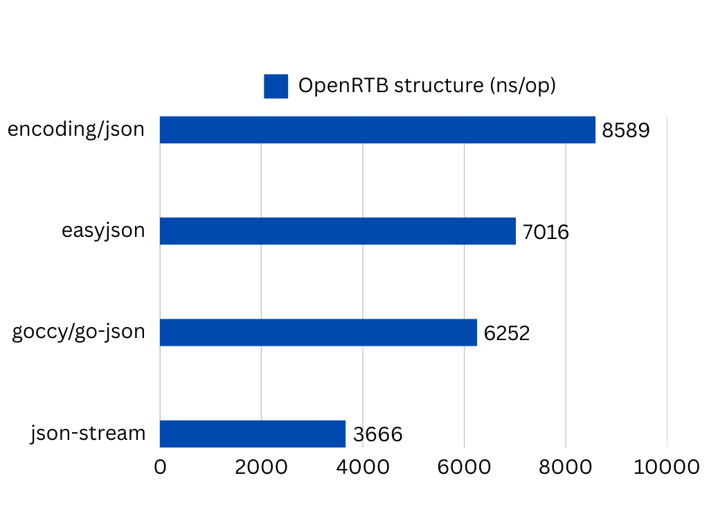

# Json-stream Marshaling and Unmarshaling Library

This library provides a fast and efficient solution for JSON marshaling and unmarshaling in Golang through code generation and `quicktemplate`. It is particularly effective for structures with a large number of fields, ensuring optimal performance and reduced overhead compared to traditional JSON encoding/decoding approaches.

## Features
- **Code generation for high-performance JSON marshaling and unmarshaling.**
- **Unmarshaling Features**:
  - Automatic handling of interface fields, common in protobuf-generated structures (`oneof`).
  - Custom `boolean` decoder that correctly interprets `true`, `false`, `1`, and `0`.
  - Configuration for required fields via a JSON file.
  - Configuration for fields to be treated as raw strings during unmarshaling.
- **Marshaling Features**:
  - Support for various field types, including integers, strings, booleans, floats, slices, maps, structs, and pointers.
  - Custom handling for `structpb.Struct`.
  - Generation of `CopyFrom` functions for structures with customizable field redefiners.
  - Generation of `GetValueUnsafePointer` to retrieve a field's value via an unsafe pointer.
  - `boolToInt` flag to automatically convert boolean types to integers during marshaling.

## Getting Started

### 1. Installation
Install `json-stream` and `qtc` (the quicktemplate compiler):
```bash
go install github.com/Adtelligent/json-stream@latest
go install github.com/valyala/quicktemplate/qtc@latest
```

### 2. Code Generation
Run the `json-stream` command, providing the source file, output directory, and any configuration files.

```bash
json-stream \
  -boolToInt \
  -copyFunctionsFeature \
  -requiredFields=path/to/required_fields.json \
  -rawStringFields=path/to/raw_string_fields.json \
  path/to/your_struct_file.go \
  path/to/output/dir/
```

This will generate `*.gen.go` and `*.gen.qtpl` files in the specified output directory.

### 3. Compile Templates
Compile the generated `.qtpl` files using `qtc`:
```bash
qtc -dir=path/to/output/dir/
```
This will produce the final `*.gen.qtpl.go` files required by your project.

## Flags
- `-boolToInt` (boolean): Enable the conversion of boolean types to integers (`1` or `0`) during **marshaling**.
- `-copyFunctionsFeature` (boolean): Generate `CopyFrom` and `Filter` functions for structures.
- `-requiredFields` (string): Path to a JSON file specifying required fields for **unmarshaling**.
- `-rawStringFields` (string): Path to a JSON file specifying fields to be treated as raw strings during **unmarshaling**.


## Customizing Field Copying
You can control which fields are copied by implementing the `FieldsRedefiner` interface. The default implementation is shown below:
```go
var DefaultFieldsRedefiner = &NoOpFieldRedefiner{}

type FieldRedefiner interface {
Redefine(path string, src unsafe.Pointer, dst unsafe.Pointer) bool
}

type NoOpFieldRedefiner struct {}

func (m *NoOpFieldRedefiner) Redefine(path string, src unsafe.Pointer, dst unsafe.Pointer) bool {
return false
}
```

## Supported Field Types
The library supports JSON marshaling for the following field types:
- **Integers**: `int`, `int8`, `int16`, `int32`, `int64`, `uint`, `uint8`, `uint16`, `uint32`, `uint64`
- **Strings**
- **Booleans**
- **Floats**: `float32`, `float64`
- **Slices and arrays**
- **Maps**
- **Structs**
- **Pointers**

Additional handling for `structpb.Struct` is included.

## Benchmarks

### Marshaling
The benchmark was conducted using a data structure based on the [OpenRTB protocol](https://developers.google.com/authorized-buyers/rtb/downloads/openrtb-proto) from Google.


## Contributing
Contributions are welcome! Feel free to open issues or submit pull requests.

---
For more details, check out the source code or contact the maintainer.